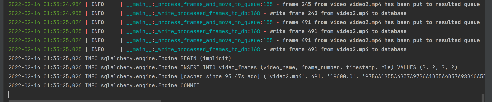

## How to use

1. install dependencies 
2. run script main.py
3. wait till processing done
4. processing is done when there is no new output in stdout
5. stop script main.py
6. done (results in frames.db file)

## Some screens

After main.py script started there is first line in logs describing files count to be processed 

When processing is done, stdout will not keep being updated
At this moment, we can stop script main.py and check results

